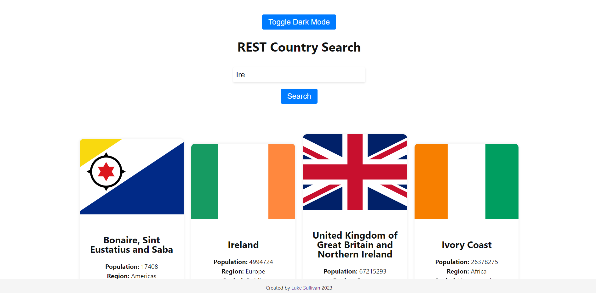

# REST Countries using ReactJS, NodeJS and Express!

This application is my solution to the Bounce Insights Coding Challenge.

Table of Contents

- [Screenshot](#screenshot)
- [Link](#link)
- [Local Setup](#local-setup)
- [Reflection](#reflection)

<a name="screenshot"/>

### Screenshot:

<a name="link"/>

### Link to website on Render:

https://rest-countries-frontend.onrender.com/

<a name="local-setup"/>

### How to set up locally:

Clone this repository. You will need node and npm installed globally on your machine.

Installation:
  
<code>npm install</code>
  
To start server:
  
<code>cd server</code>
  
<code>npm run dev</code>

You should see the following or similar:
<pre>Server running on port 5000</pre>

Then on another terminal (can be made by clicking "New Terminal" on VS Code):
  
<code>cd client</code>
  
<code>npm start</code>
  

The client should then open in localhost:3000

### Reflection:

<b>What I feel worked well:</b>
<ul>
    <li>Express was fairly straight forward to set up, this was admittedly my first time using Express.</li>
  <li>Gave me a good opportunity to brush up on my ReactJS and NodeJS skills.</li>
  <li>Design is simple and effective, UI is very self explanatory</li>
</ul>

<b>How I could extend the project in the future:</b>
<ul>
  <li> Make each country clickable, giving the user more information about the country </li>
  <li> Interactable map to show each country (?) </li>
  <li> A more complex, intriguing design (?) </li>
</ul>
